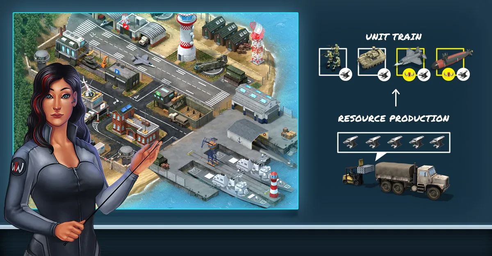

# Bases in World War Online

World War Online features several types of bases, each with its own purpose and strategic importance:

-   **Headquarters Base** - Your primary base that provides Iron production and unit capacity
-   **Capital Bases** - Strategic conquest points (see more in [Capital Warfare](capital-warfare.md))
-   **Military Bases** - Enhance unit training capabilities and provide unit capacity
-   **Resource Bases** - Generate various resources (Money, Food, Brick) and provide unit capacity
-   **Mine Bases** - Specialized in Iron production and provide unit capacity

## Unit Capacity

Each non-capital base you own provides capacity for **10,000 Normal Units**. This means:

- **Headquarters Base**: +10,000 unit capacity
- **Military Base**: +10,000 unit capacity (per base, max 5 bases)
- **Resource Base**: +10,000 unit capacity (per base, max 10 bases)
- **Mine Base**: +10,000 unit capacity (per base, max 4 bases)
- **Capital Bases**: No unit capacity

**Important:** Only [Normal Units](units-normal.md) count toward your unit cap. [Supreme Units](units-supreme.md) and [Tactical Units](units-tactic.md) do not consume unit capacity.

**Example:** A player with 1 Headquarters + 5 Military Bases + 10 Resource Bases + 4 Mine Bases = 20 bases × 10,000 = **200,000 maximum Normal Units**.

## Automatic Base Defense

Your bases now feature automatic defense setup to ensure they're never left completely undefended:

-   **Auto-Defense System**: When you haven't created a defense setup yet or have insufficient units positioned, the system automatically sets up defenses using your strongest available units
-   **Smart Prioritization**: The system prioritizes your largest unit groups first and maximizes unit type diversity to create a balanced defense
-   **Strategic Positioning**: Units are placed strategically to maximize defensive effectiveness
-   **Fully Customizable**: You can still edit and customize these automatic defenses at any time to match your preferred strategy
-   **Complete Control**: You maintain full control over your defensive strategy while having a solid baseline defense automatically created
-   **Peace of Mind**: Never worry about leaving a base undefended - the system has you covered

This feature is particularly useful when managing multiple bases, when you need to quickly set up defenses across your territory, or when enemy units in districts become visible and targetable.

## Base Construction Costs

Building bases requires [WWO-Influence](resources.md), with the cost varying by type:

- **Military Base**: 2 WWO-Influence (fixed cost)
- **Resource Base**: 4 WWO-Influence (base cost)
- **Mine Base**: 8 WWO-Influence (base cost)

**Important**: The cost of Resource and Mine bases increases based on how many resource bases you already have. For every 2 resource/mine bases you own, the cost increases by 1 WWO-Influence:

| Number of Resource/Mine Bases | Resource Base Cost | Mine Base Cost |
|:----------------------------:|:------------------:|:--------------:|
| 1                            | 4                  | 8              |
| 2                            | 4                  | 10             |
| 3                            | 5                  | 12             |
| 4                            | 5                  | 14             |
| 5                            | 6                  | -              |
| 6                            | 6                  | -              |
| 7                            | 7                  | -              |
| 8                            | 7                  | -              |
| 9                            | 8                  | -              |
| 10                           | 8                  | -              |

**Cost Calculation:**
- Resource Bases: +1 WWO cost for every 2 resource bases
- Mine Bases: +2 WWO cost for each additional mine base

Note: You are limited to a maximum of 10 Resource bases and 4 Mine bases per player.

## Headquarters Base

Upon creating an account in World War Online, you will receive a **Headquarters Base** placed
randomly in the territory of your Country, which cannot be relocated.

The Headquarters Base is your primary base that provides a steady Iron production and also acts as a
Military Base, producing units. **Upgrading your Headquarters allows you to increase your Resource
Production and Increase your Daily Steal Capacity**. Although your Headquarters can be raided, it
cannot be Conquered or Destroyed.

### Headquarters Defense Bonus

Districts containing your Headquarters provide enhanced defensive capabilities:

- **8 unit groups** can be positioned for defense (instead of the standard 6)
- **4,000 normal units** can be deployed (instead of the standard 3,000)
- This strategic advantage helps protect your command center and surrounding territory
- The headquarters defense bonus is indicated with a special badge in the district view

### How to Upgrade your Headquarters Base

Your Headquarters Base can be upgraded to increase its' benefits, namely to increase the production
of [Iron](resources.md).

You can upgrade your Headquarters using Iron, and everytime it levels up you will get some XP
besides increasing the Iron Production. If you want to **accelerate the upgrade process**, you can
use [WWO-Influence](resources.md), the in-game currency of World War Online.

The production rate depends on the level of the Headquarters Base, where a higher level base
produces more resources. Your production rate also dictates the amount of units that you can have in
your army, as units have [Upkeep](unit-stats.md).

**Note:** Experience (XP) values shown are approximate and increase exponentially with each level.

### Headquarters Base Levels

| Base Level | Upgrade Time | XP Gained | Iron Production p/ hour | Upgrade Cost (Iron) |
| :--------: | :----------: | :-------: | :---------------------: | :-----------------: |
|   **1**    |      -       |     -     |          1,650          |          -          |
|   **2**    |  2 minutes   |    500    |          1,800          |       1,000         |
|   **3**    |  5 minutes   |    625    |          1,950          |       2,000         |
|   **4**    |  10 minutes  |    900    |          2,100          |       4,000         |
|   **5**    |  30 minutes  |   1,350   |          2,250          |       8,000         |
|   **6**    |   1 hour     |   2,000   |          2,400          |      16,000         |
|   **7**    |   2 hours    |   2,900   |          2,550          |      32,000         |
|   **8**    |   4 hours    |   4,000   |          2,700          |      50,000         |
|   **9**    |   8 hours    |   5,350   |          2,850          |      75,000         |
|   **10**   |  12 hours    |   7,000   |          3,000          |     100,000         |

## Resource Bases

Resource Bases produce Iron continuously and can be upgraded to increase production. You can build up to 10 Resource bases per player.

### Resource Base Levels

| Base Level | Upgrade Time | XP Gained | Iron Production p/ hour | Upgrade Cost (Iron) |
| :--------: | :----------: | :-------: | :---------------------: | :-----------------: |
|   **1**    |      -       |     -     |           640           |          -          |
|   **2**    |  2 minutes   |    125    |           680           |       1,000         |
|   **3**    |  5 minutes   |    156    |           720           |       2,000         |
|   **4**    |  10 minutes  |    225    |           760           |       4,000         |
|   **5**    |  30 minutes  |    337    |           800           |       8,000         |
|   **6**    |   1 hour     |    500    |           840           |      16,000         |
|   **7**    |   2 hours    |    725    |           880           |      32,000         |
|   **8**    |   4 hours    |   1,000   |           920           |      50,000         |
|   **9**    |   8 hours    |   1,337   |           960           |      75,000         |
|   **10**   |  12 hours    |   1,750   |          1,000          |     100,000         |

## Mine Bases

Mine Bases produce significantly more Iron than Resource bases but are limited to 4 per player. They have the highest resource production rate among all base types.

### Mine Base Levels

| Base Level | Upgrade Time | XP Gained | Iron Production p/ hour | Upgrade Cost (Iron) |
| :--------: | :----------: | :-------: | :---------------------: | :-----------------: |
|   **1**    |      -       |     -     |           875           |          -          |
|   **2**    |  2 minutes   |    125    |          1,000          |       1,000         |
|   **3**    |  5 minutes   |    156    |          1,125          |       2,000         |
|   **4**    |  10 minutes  |    225    |          1,250          |       4,000         |
|   **5**    |  30 minutes  |    337    |          1,375          |       8,000         |
|   **6**    |   1 hour     |    500    |          1,500          |      16,000         |
|   **7**    |   2 hours    |    725    |          1,625          |      32,000         |
|   **8**    |   4 hours    |   1,000   |          1,750          |      50,000         |
|   **9**    |   8 hours    |   1,337   |          1,875          |      75,000         |
|   **10**   |  12 hours    |   1,750   |          2,000          |     100,000         |

## Military Bases

Military Bases are used to train units and defend strategic positions. You can build up to 5 Military bases per player. Unlike resource-producing bases, Military bases generate defensive power rather than Iron. Each Military Base also provides capacity for 10,000 Normal Units.

### Military Base Levels

| Base Level | Upgrade Time | XP Gained | Defense Power | Upgrade Cost (Iron) |
| :--------: | :----------: | :-------: | :-----------: | :-----------------: |
|   **1**    |      -       |     -     |      200      |          -          |
|   **2**    |  2 minutes   |     62    |      250      |       1,000         |
|   **3**    |  5 minutes   |     78    |      300      |       2,000         |
|   **4**    |  10 minutes  |    112    |      400      |       4,000         |
|   **5**    |  30 minutes  |    168    |      500      |       8,000         |
|   **6**    |   1 hour     |    250    |      750      |      16,000         |
|   **7**    |   2 hours    |    362    |     1,000     |      32,000         |
|   **8**    |   4 hours    |    500    |     1,500     |      50,000         |
|   **9**    |   8 hours    |    668    |     2,000     |      75,000         |
|   **10**   |  12 hours    |    875    |     2,500     |     100,000         |

**Note:** The "Defense Power" value represents the base's contribution to defensive capabilities when units are stationed there.

## Related Guides

- [Unit Capacity System](unit-train.md#unit-capacity-system) - How bases provide unit capacity
- [Resources](resources.md) - Resource production and base upgrades
- [Battle Rules](battle-rules.md) - Conquest and destruction rules
- [Tactical Units](units-tactic.md) - Conquering and destroying bases
- [Capital Warfare](capital-warfare.md) - Attacking capital bases
