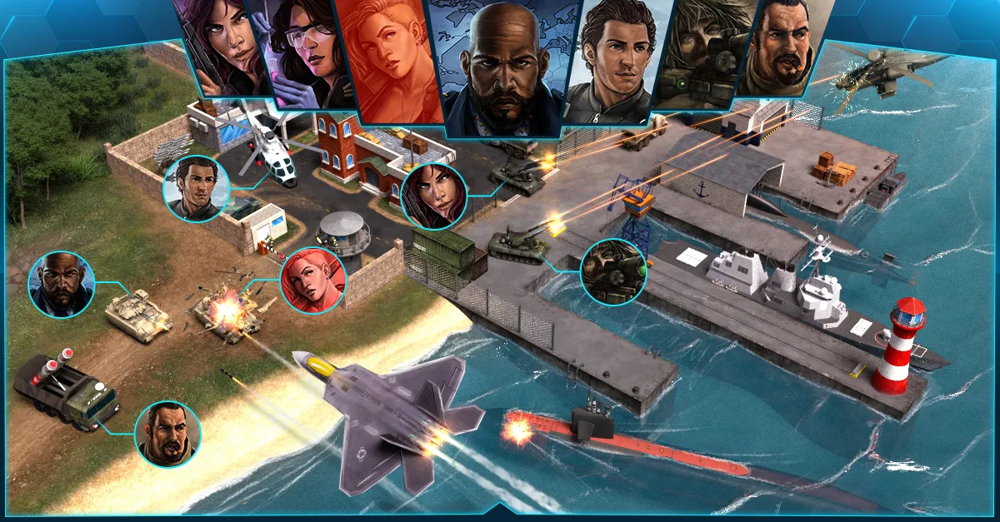

# Battalions

Battalions are an optional feature in World War Online, but to experience the primary objective of the
game, which is [Capital Warfare](capital-warfare.md), a player must belong to a Battalion. It is
strongly recommended that every player join a Battalion, as you can unlock many features by being part
of a battalion, as collaboration is an important and very helpful aspect of World War Online.

## What is a Battalion?

Battalions are united groups of players with a collective goal; together they can conquer Capitals,
compete in the [Leaderboard](leaderboard-battalion.md) or Support each other in Battles. Each Battalion
**may have up to 8 members**, 7 of which may be from a foreign country. Additionally, each Battalion has
one Battalion Leader and up to three Battalion Captains with additional Battalion-Related rights.

## Joining a Battalion

To become a member of a Battalion, there are several methods you can use:

-   You can send a message in the Global Chat saying you are looking for a Battalion.
-   Accepting an invitation sent by a Battalion Leader/Captain to join their Battalion.
-   Clicking on "Join a Battalion" under your [Missions](index.md#mission-center) you can see all the
    current available Battalions, both from your Country and Worldwide. You can choose one and click in
    the button "Request to Join" so the Leader receives a warning and then accept your request.

## Creating a Battalion

You can also create your own Battalion, as long as you are [rank 25 or higher](player-rank.md).

**If you fulfill this condition, then you have follow this process:**

-   Click on your Country under your Profile.
-   Click on Create a Battalion.
-   Select a Battalion Name.
-   Once your battalion is created you can edit the settings in your Battalion Profile.

## Battalion Roles

### Leader

The Battalion Leader (generally the player who created the Battalion) has access to every tool in the Battalion,
including accepting new members, initiating the search for Capital Warfare and choosing Battalion
Captains or a new Battalion Leader. Battalion Leaders can also kick members from the Battalion including
Captains.

They also have the ability to create a new Forum post for the Battalion where every player that logs
into the game, will automatically view it.

### Captain

The Battalion Captains are the seconds-in-command and they have control over the same Battalion Features as
the Leader with the exception of selecting new Battalion Captains, a new Battalion Leader and kicking other
Captains.

### Member

A Member is an ordinary member in the Battalion that has no additional rights. This is the rank you
start at when you join a Battalion. Members cannot invite or promote players. They can also be kicked
from the Battalion by Captains and Leaders.

Rejoining a battalion where you were once a captain will not make you a Captain again: you will return
to the rank of Member until you get promoted again.

## Battalion Chat

Once you join a Battalion, you gain access to its private chat. This [chat](chat.md) shows all recent
messages, including those sent before you joined. This chat serves the purpose of defining your
strategies as a Battalion rather than having to send private messages to each Battalion member.

## General Battalion Features

-   **Change Battalion Name**: First name change is free. After this changing the name costs 25
    WWO-Influence
-   **Change Battalion Photo**: Here you can Add a Battalion Avatar - Where the first change is free, and
    subsequent Avatar changes cost 10 WWO-Influence
-   **Change Battalion Background Image**: you can upload an image.
-   **Close Battalion**: This will close the battalion and kick out all members.
-   **Leave Battalion**: You can leave your Battalion from here. If you are the last member, it will be the
    same as closing the Battalion.

## Sending Support

Players in Battalions have the ability to set the Authorization of their Army in Settings, where other
Battalion members can use their armies so long as they are located in the same
[District](maps-movement.md).

The advantage of this is that players belonging to a Battalion can use **up to 10 Units in Battle**,
whereas those who are not in a battalion can only use up to 5. This is one of the major components of
being part of a Battalion.

## Changing Battalions

You can change Battalions at any given time. However, if you do it after the **Capital Warfare
Matchmaking** is done, you won't be able to fight until the next Matchmaking. If this happens and
you have armies in an active capital, we recommend you **move your armies** to another location, as
**the system will prevent you from attacking, but your units can still be killed by other players.**

## Close Battalion

Only the Battalion Leader can close the battalion. This will erase all statistics and kick all members from
the battalion. Battalions can be closed at any time, except during the final 14 days of each season.

## Battalion Alliances

-   Battalion Leaders and Captains can invite other Battalions for an alliance, accept and deny alliance
    requests, and break current alliances.
-   Battalions can have a maximum of 2 allies at each time.
-   Allied Battalions won't be matched up against each other at the start of Capital Warfare.
-   Allies can help each other during Capital Warfare, by attacking armies in Capitals they otherwise
    couldn't. Players can attack the armies of their Ally's enemies on the Capital Bases contested
    by the Ally.

## Related Guides

- [Capital Warfare](capital-warfare.md) - Main battalion competition mode
- [Battalion Leaderboard](leaderboard-battalion.md) - Rankings, leagues, and rewards
- [Battle Rules](battle-rules.md#capital-specific-rules) - Rules for attacking capitals
- [Tactical Units](units-tactic.md) - Using Generals to conquer bases
- [Chat](chat.md) - Communicate with Battalion members
