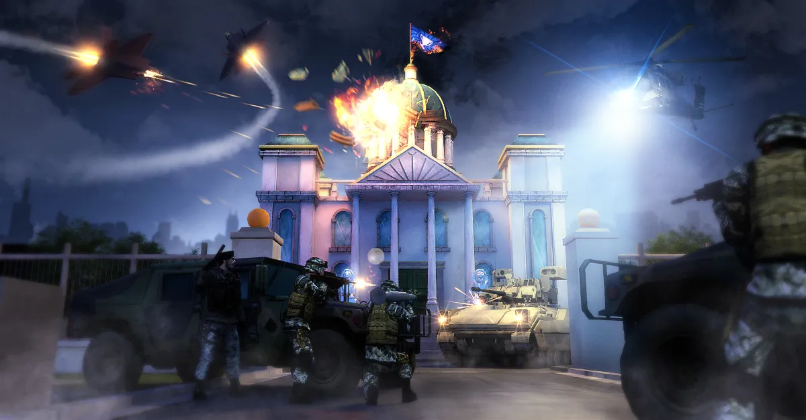
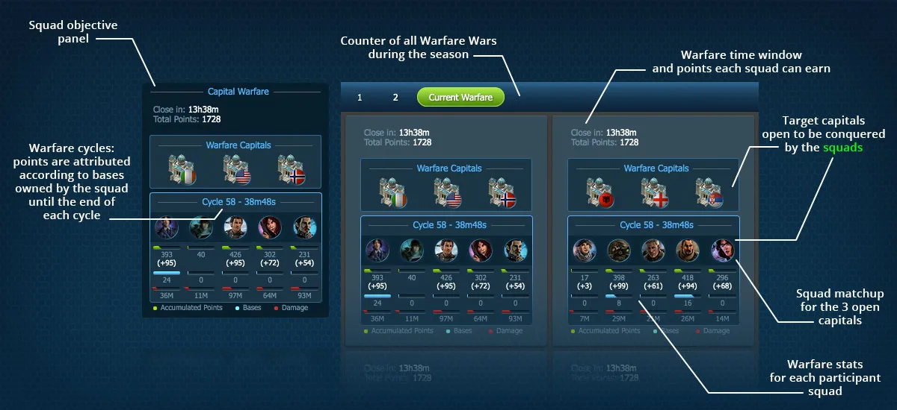
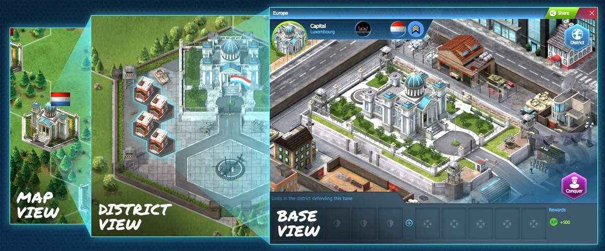

# Capital Warfare

Capital Warfare is a in the heart of World War Online strategic gameplay. During each Capital
Warfare 5 Squads are put into battle for 3 Country capital's, engaging in epic battles and strategic
alliances. Each Capital Base rewards a certain number of points depending on the period of the
Season.

## How it works

The [Squad Leaderboard](leaderboard-squad.md) is composed of Squads that are currently competing by
participating in Capital Warfare, and conquering Capital Bases to gain points.

Each Squad starts out as Unranked and once they get their first points, they immediately placed in
the Leaderboard.

At the end of every capital warfare, the top 2 Squads are promoted to the League above, and at the
same time, the bottom 2 Squads are demoted to the League below. The promoted and demoted squads will
be at the bottom/top of their new League respectively. At the end of the Season, the top 5 Squads
host their respective country's flags in the podium.

## Capital Warfare cycles

Capital Warfare cycles are as described in the image below. The green zones indicate when the
Capital Warfare is open and the cooldown periods are between cycles.

### We are updating this section for the updates of Season 4 / Championship 2021

## Squad Matchmaking

The matchmaking system in World War Online matches you against 5 random Squads in your League.
Matchmaking will occur before each new Capital Warfare cycle.

## Conquering a Capital Base

In Capital Districts, when you attack and win the base you immediatly Conquer them. When you click
on Conquer on a Capital Base, you will automatically generate a General which is a Tactical Infantry
that is capable of Conquering Bases.

The General will count as an Extra Unit, and it cannot fight alone. You must send units along with
the General to fight and conquer the Base that you are attacking. The General appears on the 11th
Wave of the Battle.

-   To Conquer a base, the General must survive the outcome of the battle.
-   The battle must be a Decisive Victory, i.e. it cannot be settled as a Tie Breaker.
-   If the General dies, but you win the battle, you will not Conquer the base.

