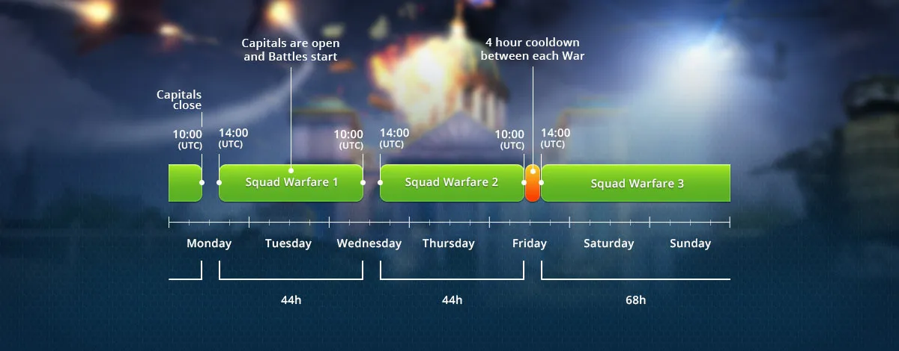

# Capital Warfare

Capital Warfare is at the heart of World War Online strategic gameplay. During each Capital
Warfare 5 Battalions are put into battle for 3 Country capitals, engaging in epic battles and strategic
alliances. Each Capital Base rewards a certain number of points, with progressive multipliers applied
based on how close the season is to ending, making the final weeks more strategic and competitive.

## How it works

The [Battalion Leaderboard](leaderboard-battalion.md) is composed of Battalions that are currently competing by
participating in Capital Warfare, and conquering Capital Bases to gain points.

Each Battalion starts out as Unranked and once they get their first points, they immediately placed in
the Leaderboard.

At the end of every capital warfare, the top 2 Battalions are promoted to the League above, and at the
same time, the bottom 2 Battalions are demoted to the League below. The promoted and demoted battalions will
be at the bottom/top of their new League respectively. At the end of the Season, the top 5 Battalions
host their respective country's flags in the podium.

## Capital Warfare Cycles

Capital Warfare operates on a simple one-week cycle system with predictable timing:

### Cycle Schedule

- **Start Time**: Every Wednesday at 12:00 UTC (midday Portugal time)
- **Combat Duration**: 6 days and 12 hours (6.5 days)
- **End Time**: Tuesday at 24:00 UTC / Wednesday at 00:00 UTC (one week after start)
- **Preparation Window**: 12 hours between cycles (00:00-12:00 UTC on Wednesday)
  - Cleanup phase: 00:00-02:00 UTC (warfare ends, units return, promotions/demotions processed)
  - Preparation phase: 02:00-12:00 UTC (new cycles created, matchmaking occurs)

This simplified 1-week cycle makes it easier to plan your battalion's strategy, with Capital Warfare starting every Wednesday at noon UTC and running for one week.

### Progressive Point Multipliers

Capital points now use a progressive multiplier system that increases as the season approaches its end, making the final weeks more strategic and competitive:

- **Final week** (≤8 days before season end): **4x multiplier**
- **Second-to-last week** (≤15 days before season end): **3x multiplier**
- **Third-to-last week** (≤22 days before season end): **2x multiplier**
- **Regular season** (>22 days before season end): **1x multiplier** (normal points)

The active multiplier is displayed in the Capital Warfare interface with a colored chip indicator, helping you track when strategic pushes for capitals will have the most impact on the leaderboard.

## Battalion Matchmaking

The matchmaking system in World War Online matches you against 5 random Battalions in your League.
Matchmaking will occur before each new Capital Warfare cycle.

## Conquering a Capital Base

In Capital Districts, when you attack and win the base you immediatly Conquer them. When you click
on Conquer on a Capital Base, you will automatically generate a General which is a Tactical Infantry
that is capable of Conquering Bases.

The General counts as an extra unit and does not count toward your 6-unit group limit, allowing you to bring a General alongside your full complement of troops. The General cannot fight alone - you must send units along with the General to fight and conquer the base you are attacking. The General appears on the 11th wave of the battle.

-   To Conquer a base, the General must survive the outcome of the battle.
-   The battle must be a Decisive Victory - it cannot be settled as a Tie Breaker.
-   If the General dies but you win the battle, you will not Conquer the base.
-   The General gives you more tactical flexibility by not consuming one of your standard unit slots.

## Related Guides

- [Battalions](battalions.md) - Join or create a battalion to participate in Capital Warfare
- [Battle Rules](battle-rules.md#capital-specific-rules) - Capital-specific battle requirements
- [Tactical Units](units-tactic.md) - Using Generals to conquer capitals
- [Battalion Leaderboard](leaderboard-battalion.md) - League system and rewards
