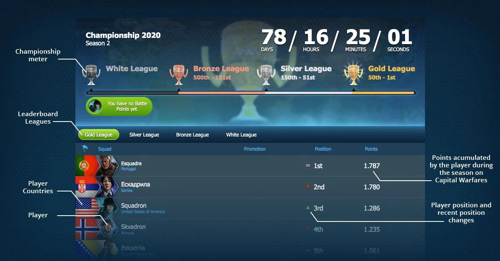

# Player Leaderboard

The Player Leaderboard is an individual competition that's completely separate from the main
Leaderboard. In the Player Leaderboard, players get points for winning Battles against other
players. Its purpose is to showcase the top Commanders of the current Season.

## The Standings

You receive points for each battle you win. By reaching certain positions, you will get promoted to a higher League:

-   **Gold League**: Top 10 players (positions 1-10)
-   **Silver League**: Positions 11-20
-   **Bronze League**: Positions 21-30
-   **Iron League**: Position 31st onwards

For more details, check the [Leaderboard](https://www.worldwaronline.com/leaderboard).
