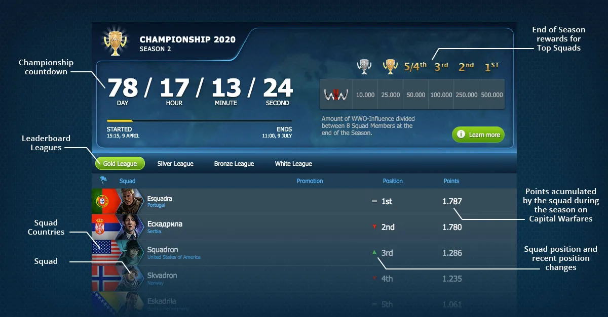

# Squad Leaderboard

The Squad Leaderboard is composed of the Squads that are currently competing by participating in
Squad Wars against other Squads and conquering Capital Bases to get points. Each Squad starts out as
Unranked and once they get their first points, they immediately get placed in the Leaderboard. With
enough points, Squads get promoted to the Silver and Gold League, where finally at the end of the
Season, the top 5 Squads host their respective country's flags in the podium.

## Leagues

There are 4 Leagues in World War Online, and at the end of the Season, players from squads in different leagues receive varied rewards based on their Ranking. Squads are ranked based on the number of Points they have:

-   **Gold League**: Top 10 squads (positions 1-10)
-   **Silver League**: Positions 11-20
-   **Bronze League**: Positions 21-30
-   **Iron League**: Position 31st onwards

## End of Season Rewards

At the end of each Season, the squads in top 5, Gold and Silver League will be awarded with
WWO-Influence.

-   **1st:** 50.000 WWO
-   **2nd:** 25.000 WWO
-   **3rd:** 10.000 WWO
-   **4th/5th:** 5.000 WWO

This amount of WWO-Influence is divided between 8 Squad Members at the End of the Season. Also, all
the remaining Squads in Gold League receive 2.500 WWO and all squads in Silver receive 1.000 WWO.

## How to get Points

To learn how to gain points for your Squad, check [**Capital Warfare**](capital-warfare.md) section.

### Point Multiplier System

Capital Warfare features a **progressive point multiplier system** that makes the final weeks of the season significantly more impactful and competitive. Points earned from Capital Warfare scale based on when the warfare was created relative to the season end:

#### Multiplier Timeline

-   **4x points** - Final week (warfare created ≤8 days before season end)
-   **3x points** - Penultimate week (warfare created ≤15 days before season end)
-   **2x points** - Third-to-last week (warfare created ≤22 days before season end)
-   **1x points** - All other times (>22 days before season end)

#### How It Works

When a Capital Warfare is created, the system calculates how many days remain until the season ends and assigns a permanent multiplier to that warfare. **This multiplier never changes**, even if the season end date is adjusted.

All points earned during that specific Capital Warfare—from controlling capital bases, dealing damage, and individual player contributions—are multiplied by this value.

#### Strategic Impact

The final 3 weeks (with 2x, 3x, and 4x multipliers) are equivalent in impact to the previous 9 weeks of regular season play. This creates:

-   **Increased competition** as the season progresses
-   **More engaging end-of-season gameplay**
-   **Greater rewards for consistent participation** throughout the season
