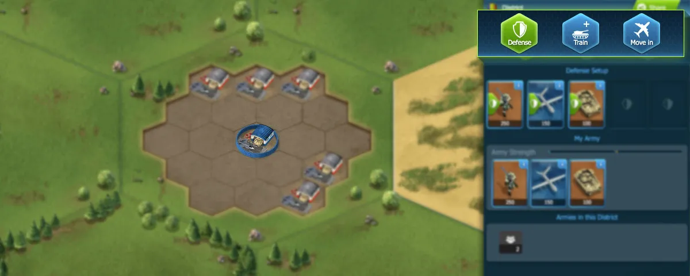
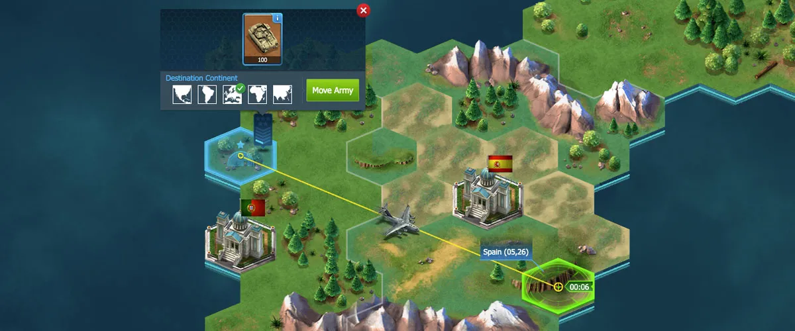

# World War Online Map

## Map

The Map is divided into 3 main views:

-   **The Continent View**, which will give you a general view of the continent you are currently
    in, as well as its Districts and Capitals;
-   **The District View**, which will show you the Bases and Armies stationed inside the District
    you are in;
-   **The Base View**, which will give you access to the Base's actions, like upgrading the Base or
    Training Units if it's your Base or sending an attack if it belongs to an enemy.

## District

Districts are small sectors that each Continent is separated into and it's where players can find
Bases. There are 3 main types of Districts:

### 1. Guerrilla

These compose the majority of the World Map. You can produce or move in all types of Air and Land
units here.

### 2. Coastal

These are also Guerilla districts, but are located next to a bed of water. Players can use these
Districts to produce Navy Units.

### 3. Capital

Country Capitals are only accessible to players within a Squad participating in Squad Wars. They
have a fixed amount of Bases. If you're a member of a Squad, you can attack and conquer these Bases
to earn points in the Leaderboard through Squad Wars.

## Actions Available in Districts

When a player opens a district they will also open with it a sidebar that contains all the necessary
info about this district including:

**Buttons**:

-   **Manage Defense:** This button will be available if you have units in the district that you can
    set up on the battlefield in case you get attacked.
-   **Train Units:** This button will be available in all districts.
-   **Move In:** This button allows you to select Units from anywhere on the World Map, to move to
    the district that is selected.

It also shows:

-   Your current Defense Setup;
-   Your Army in the District;
-   Armies in the district belonging to other Squads or Guerilla Armies (Not belonging to a Squad);
-   The 5 latest battles in the last 2 Hours.

Keeping the District Sidebar open (By not leaving the district, you can watch all the latest battles
that are occurring in the district in real time.

## Movement

To get around in the world, players need to understand movement. There are 2 ways that players can
move around the map:

-   **Clicking on the Unit Flag:** This will allow you to click on Move and drag the cursor to
    wherever you want on the map. Clicking on another continent will allow you to move those units
    to another continent.
-   **Clicking on any district** will have the “Move” button on the top right corner in the District
    Sidebar. This will show all units that are available to be moved in that continent. You can also
    select different continents from the top menu when moving to a district.

Movement takes time, but you do have the option to accelerate unit movements via
[WWO-Influence](resources.md). The cost to accelerate unit movements are determined by each given
distance.
