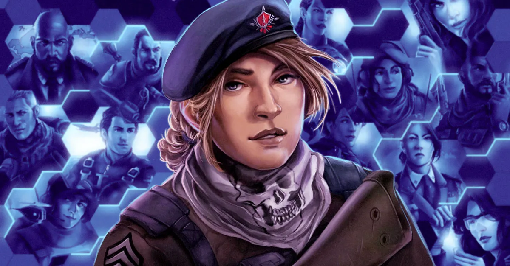

# Create an Account

## Creating a World War Online Account

In order to join World War Online and start planning your battles, you need to create an account
either on Browser or App.

These are the currently available options:

-   Email and Password;
-   Facebook Login;
-   Google Login.

### Forgetting your password

If you forget your login password, you can select the option "Recover Password" in Login/Register
section. Then, you just have to insert your email, click in "Submit" and you will receive an email
to change your password. If this doesn't work, please contact us on one of our
[Support channels](/support) ..md

## Selecting a Country

When creating an account in World War Online, each player will select the Country he or she
represents. Countries are very important in World War Online, as each Squad will represent its'
specific Country.

There are 142 Countries in World War Online that players can represent. Each containing a Capital
Base that can be fought for and conquered when squads participate in Capital Warfare.

## Choosing your Codename

Upon creating an account you will be asked to associate a Codename. This will be your official
in-game name, so we recommend you choose something that doesn't identify you. (You can read more
about this in our [Privacy Policy](../legal/privacy.md)).

## Your profile

In your profile section (you can access it by clicking in your avatar image), you can access to
different data about your account.

-   Your codename;
-   You Avatar image;
-   Your current Rank;
-   Your position in Single Player Leaderboard.

If you are in a [Squad](squads.md) you can also access information about it, by clicking in the
Squad Name (bar above your profile information).

## Stats

In this section you can see all stats related to your performance in the game, namely:

-   Your [Headquarter's Base](bases.md) current level;
-   Your Nemesis: players who attacked you more;
-   Battle Ratio: total percentage of damage dealt and suffered;
-   Enemy Units Killed: Supreme, Normal and Generals;
-   Season Awards: your personal history in past Seasons of World War Online.

## Awards

In this section you can find some unlockable achievements, that will grant you some experience
points. Everytime you achieve one you have the ability of collecting the reward and respective
medal.

## Edit Profile

**Here you can edit:**

-   **Your Avatar image:** you can either choose one of the available avatars or upload your own
    picture (max. 5 MB).
-   **Your Codename:** You can only change your codename once per week. The first codename change is
    free, after that each change costs 1000 [WWO-Influence](resources.md).
-   **Your Background Image**: as you go up on the
    [Single Player Leaderboard](leaderboard-player.md), you will unlock more background images.

Before changing your codename and avatar image, we recommend that you check our
[Game Rules](../legal/rules.md).
