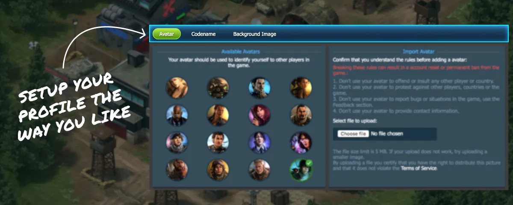

# Player Profiles

Your player profile displays your achievements, statistics, and progression in World War Online. Access your profile to track your growth and showcase your accomplishments to other players.

## Profile Information

Your profile includes:

| Section | Information Displayed |
|:--------|:---------------------|
| **Player Name** | Your in-game username |
| **Country** | Your home nation in the game |
| **Military Rank** | Your current rank and level |
| **Battalion** | Your battalion membership (if any) |
| **Season Awards** | Awards earned in previous seasons |
| **Battle Statistics** | Your combat performance metrics |

## Viewing Profiles

### Your Own Profile

Access your profile from the main menu to view:

- Current military rank and progression
- Total experience points
- Season awards and achievements
- Battle statistics and win rates

### Other Players' Profiles

View other players' profiles by clicking on their name in:

- Battle reports
- Leaderboards
- Battalion member lists
- District views

## Profile Customization

While your profile displays your achievements automatically, you can influence what others see through your gameplay:

- **Climb the ranks** to display higher military titles
- **Win battles** to improve your statistics
- **Compete in seasons** to earn prestigious awards
- **Join top battalions** to show battalion affiliations

## Related Guides

- [Military Ranks](player-rank.md) - Rank progression system
- [Season Awards](player-awards.md) - Awards from competitive seasons
- [Battle Statistics](player-stats.md) - Your combat performance
- [Battalions Overview](battalions.md) - Joining competitive battalions
