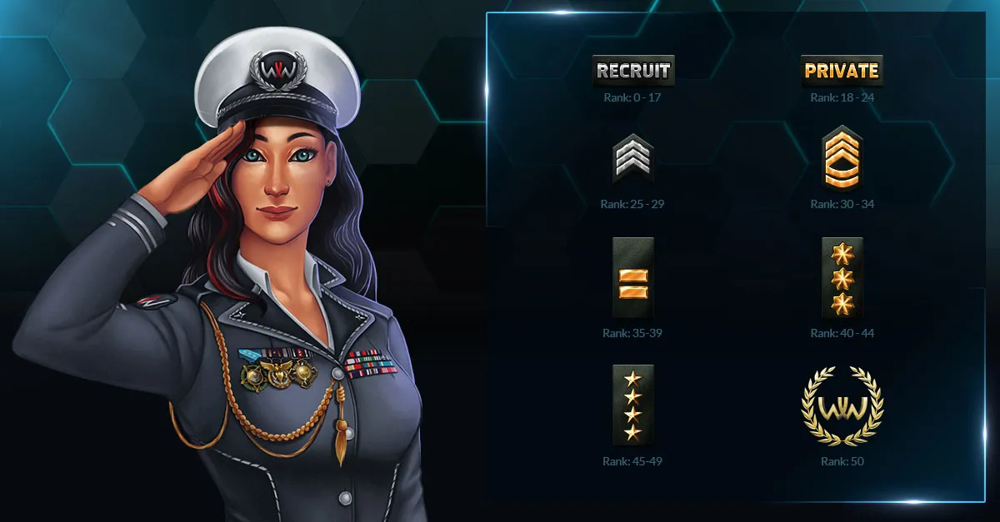

# Player Ranks

Military Ranks are the level up system in World War Online. You increase your Military Rank by
gaining Experience through winning Battles and completing Missions, building and upgrading Bases or
training [Units](unit-intro.md). When your Military Rank increases, you get several rewards,
including:

-   [WWO-Influence and Iron](resources.md);
-   Unlocked Units to train.

You always start the game as a level 5 Recruit, with access to Bradley and Bazooka units, and evolve
from there. The military ranks are Private, Sergeant, Captain, Major, Lieutenant, General and Elite
General.

**Note:** The "Army Budget" shown below refers to the maximum individual unit type limits per rank, not your total army size. Your total [Normal Unit capacity](unit-train.md#unit-capacity-system) is determined by the number of [bases](bases.md) you own (10,000 units per base).

## Rank Progression

| Rank | Levels | Army Budget (Normal) | Army Budget (Supreme) |
| :--- | :----: | :------------------: | :-------------------: |
| Recruit | 5-17 | 750 | 15 |
| Private | 18-24 | 1,500 | 20 |
| Sergeant | 25-29 | 2,250 | 25 |
| Captain | 30-34 | 3,000 | 30 |
| Major | 35-39 | 3,750 | 35 |
| Lieutenant | 40-44 | 4,500 | 40 |
| General | 45-49 | 5,250 | 45 |
| Elite General | 50 | 6,000 | 50 |

## Unit Military Rank Requirements

Below is a complete list of all active units and the military rank required to unlock them, sorted by rank:

| Unit | Military Rank |
| :--- | :-----------: |
| [Soldier](units-normal.md#soldier) | 1 |
| [Bradley](units-normal.md#bradley) | 2 |
| [Bazooka](units-normal.md#bazooka) | 3 |
| [Stinger](units-normal.md#stinger) | 4 |
| [Bakhcha](units-normal.md#bakhcha) | 5 |
| [Black Hawk](units-normal.md#black-hawk) | 6 |
| [Akula](units-normal.md#akula) | 7 |
| [LG1](units-normal.md#lg1) | 8 |
| [Reaper](units-normal.md#reaper) | 9 |
| [Chengdu](units-normal.md#chengdu) | 10 |
| [Sniper](units-supreme.md#sniper) | 11 |
| [Arleigh Burke](units-normal.md#arleigh-burke) | 12 |
| [Christy](units-normal.md#christy) | 13 |
| [Mortar](units-supreme.md#mortar) | 14 |
| [Gepard](units-normal.md#gepard) | 15 |
| [Lynx](units-normal.md#lynx) | 16 |
| [Abrams](units-supreme.md#abrams) | 17 |
| [Dongfeng](units-normal.md#dongfeng) | 18 |
| [Pomornik](units-normal.md#pomornik) | 19 |
| [General](units-tactic.md#general) | 20 |
| [Leopard](units-supreme.md#leopard) | 22 |
| [ZU-23](units-supreme.md#zu-23) | 25 |
| [Apache](units-supreme.md#apache) | 26 |
| [Los Angeles](units-supreme.md#los-angeles) | 28 |
| [Marine](units-supreme.md#marine) | 32 |
| [F-35](units-supreme.md#f-35) | 34 |
| [F-22](units-supreme.md#f-22) | 36 |
| [Daring](units-supreme.md#daring) | 38 |
| [Panther](units-supreme.md#panther) | 39 |
| [Special Forces](units-tactic.md#special-forces) | 40 |
| [Bastion](units-supreme.md#bastion) | 42 |
| [Mobile SAM](units-supreme.md#mobile-sam) | 44 |
| [Zumwalt](units-supreme.md#zumwalt) | 46 |
| [B-2 Bomber](units-supreme.md#b-2-bomber) | 48 |
