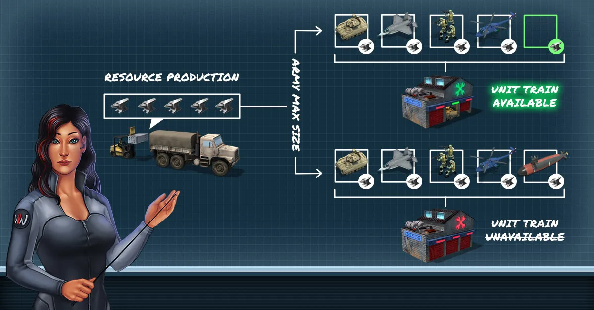

# Game Resources

Resources are the currencies used to train [Units](unit-intro.md) and to upgrade your
[Headquarters Base](bases.md).

World War Online has two different resources: **Iron** and **WWO-Influence**.

## Iron

Iron is a resource that is generated in your **Headquarters**. The amount of Iron you currently have
available is displayed at the top of the screen. A player can only have a maximum of 500.000 Iron in
his resource pool at any given time.

Iron is used to train Normal Units and to upgrade your Headquarters Base. The higher the level of
your Headquarters Base, the higher the amount of Iron you generate. You will also need Iron to
guarantee your Army's upkeep.

### Army Upkeep

**Army Upkeep** is a small amount of Resources that is subtracted from your Resource Production
every 10 minutes based on how many Units you have.

If your Resource Production is equal to your Army Upkeep, you will no longer be able to produce any
more units until your resource production is positive.

## WWO-Influence

WWO-Influence is a resource primarily gained through an in-game purchase in the [Store](store.md).

Players who end a Season in Gold and Silver Leagues for [Squad Leaderboard](leaderboard-squad.md)
also receive WWO-Influence that transfers to the next Season of World War Online.

WWO-Influence can be used to:

-   Train Supreme Units;
-   Train Normal Units (if a player is out of Iron);
-   Accelerate units movement in the map;
-   Accelerate units training;
-   Accelerate Headquarters Base upgrades;
-   Purchase Special Deals in Store.

WWO-Influence can also be collected daily, for free, through Supply Crates, but, once you get **500
WWO or more** in your account, you stop receiving the Bonuses until getting below this value again.

Also, you can only collect up to **15.000 WWO-Influence per week**.
