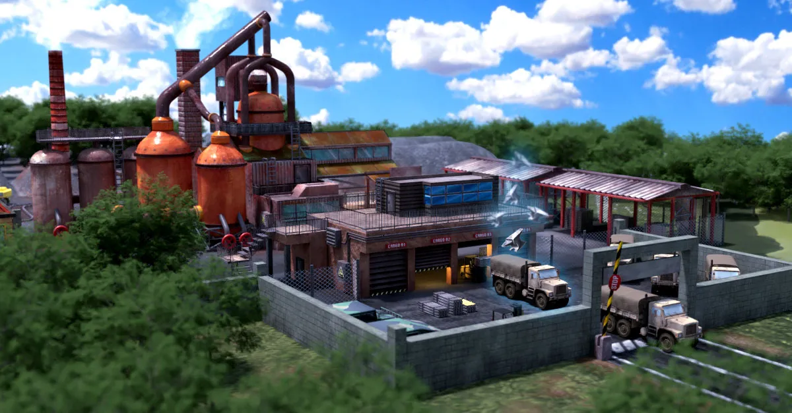

# Game Resources

Resources are essential currencies used to train [Units](unit-intro.md) and upgrade your [bases](bases.md), including your Headquarters and various specialized facilities.

World War Online has five different resources:
- **WWO-Influence** (Premium Currency)
- **Money**
- **Iron**
- **Food**
- **Brick**

## Money

Money is a resource primarily used for training [Air units](units-normal.md). It's generated from dedicated [Money Resource Bases](bases.md).

Money is used for:
- Training all Air category units (UH-60 Black Hawk, MQ-9 Reaper, Chengdu J7, Lynx)
- Supporting base construction and maintenance
- Trading with other players

Money Resource Bases can be constructed to increase your production rate. As your Money Resource Bases level up, they will produce more Money per hour.

## Iron

Iron is a resource that is generated in your **Headquarters** and specialized [Iron Resource Bases](bases.md). The amount of Iron you currently have available is displayed at the top of the screen.

Iron is primarily used for:
- Training [Armored units](units-normal.md) (BMD-3 Bakhcha, M3A3 Bradley, Gepard, Dongfeng)
- Training [Sea units](units-normal.md) (Christy, Pomornik, Arleigh Burke, Akula II)
- Upgrading your Headquarters Base

The higher the level of your Headquarters Base, the higher the amount of Iron you generate.

## Food

Food is an essential resource needed to train your [Infantry units](units-normal.md). It's produced by specialized [Food Resource Bases](bases.md).

Food is primarily used for:
- Training all Infantry category units (Soldier, Bazooka, Stinger, LG1)
- Supporting base operations

Food Resource Bases can be constructed using WWO-Influence and upgraded to increase their production rate. Strategic placement of Food Resource Bases helps ensure efficient military operations.

## Brick

Brick is a construction material resource used for creating and upgrading bases. It's produced by dedicated [Brick Resource Bases](bases.md).

Brick is used for:
- Creating new [bases](bases.md)
- Upgrading all [base types](bases.md) (Headquarters, Resource Bases, Military Bases, and Mine Bases)

Brick Resource Bases can be constructed to ensure a steady supply of this construction material. As with other resource bases, the production rate increases as you upgrade the base level.

## WWO-Influence (Premium)

WWO-Influence is the premium resource in World War Online, primarily gained through in-game purchases in the [Store](store.md).

Players who end a Season in Gold and Silver Leagues for [Squad Leaderboard](leaderboard-squad.md)
also receive WWO-Influence that transfers to the next Season of World War Online.

WWO-Influence can be used to:

- Train Supreme Units and Special Forces units
- Train Normal Units (if a player is out of their primary resource)
- Accelerate units movement on the map
- Accelerate units training
- Accelerate Headquarters Base upgrades
- Purchase Special Deals in Store
- Construct new bases (Resource, Military, and Mine bases)

WWO-Influence can also be collected daily, for free, through Supply Crates.

## Resource Stealing and Carrying Capacity

When you successfully attack enemy bases, you can steal their resources. The amount you can carry is now directly tied to your unit composition:

-   **Carrying Capacity**: Each unit can carry resources equal to **5% of its total health**
-   **Strategic Unit Selection**: Heavier units (like Dongfeng with 225 HP) can carry more resources (11.25 per unit) than lighter units (like Bazooka with 135 HP carrying 6.75 per unit)
-   **Supreme Unit Advantage**: Supreme units have significantly higher carrying capacity - for example, an Abrams tank (4,000 HP) can carry 200 resources per unit
-   **Visual Indicator**: The interface shows your unit carrying capacity versus available resources to help you plan raids
-   **Tactical Planning**: Choose your attack force based on your objectives - use heavier units when raiding for resources

This mechanic encourages strategic unit selection based on whether you're attacking for destruction or resource acquisition.

## Resource Management Tips

Effective resource management is crucial for success in World War Online:

1. **Understand unit resource requirements** - Different unit types require different resources. Plan your resource production based on your army composition strategy:
   - Infantry units require Food
   - Armored and Sea units require Iron
   - Air units require Money
   - Supreme units require WWO-Influence

2. **Balance your base portfolio strategically** - You have a maximum number of bases you can construct, so choose wisely based on your warfare strategy and current game phase:
   - **Early game**: Prioritize Brick production to rapidly build new bases and upgrade existing ones, establishing your economic foundation
   - **Mid to late game**: Shift focus to resource bases that support your preferred unit composition (Food for Infantry, Iron for Armored/Sea, Money for Air)
   - **Geographic considerations**: Balance your base types based on where you're conducting military operations and which territories you control

3. **Use WWO-Influence wisely**:
   -   Train Supreme Units for maximum combat effectiveness
   -   Build new bases strategically (remember the maximum base limit)
   -   Accelerate unit movement during critical operations
   -   Accelerate unit training when time is essential
   -   Accelerate Headquarters Base upgrades for long-term advantages
   -   Purchase Special Deals in Store for value

4. **Prioritize critical resources** - Focus on resources that align with your strategy (e.g., Food for infantry-focused armies, Iron for armored/sea units, Money for air units).

5. **Protect your resource bases** - Station units to defend valuable resource production facilities from enemy raids.

6. **Upgrade strategically** - Invest in upgrading bases that produce resources you use most frequently.

7. **Maintain reserves** - Keep a buffer of resources to respond to unexpected opportunities or threats.

8. **Use Brick efficiently** - Brick is essential for base creation and upgrades. In the early game, Brick production is particularly valuable as it enables rapid expansion of your infrastructure.

9. **Optimize raiding forces** - Select units with higher health when your primary goal is resource stealing rather than just destruction.

10. **Maximize WWO-Influence value** - Use premium currency strategically for critical advantages like Supreme Units, base construction, or time acceleration during important battles.

11. **Adapt your economy to your strategy** - Your base composition should reflect your military doctrine. A balanced approach works for versatile play, while specialized economies support focused strategies.

## Related Guides

- [Bases](bases.md) - Learn about building and upgrading resource-producing bases
- [Unit Training](unit-train.md) - Understand resource costs for training units
- [Store](store.md) - Purchase WWO-Influence and special deals
- [Squad Leaderboard](leaderboard-squad.md) - Earn WWO-Influence rewards through squad competition
