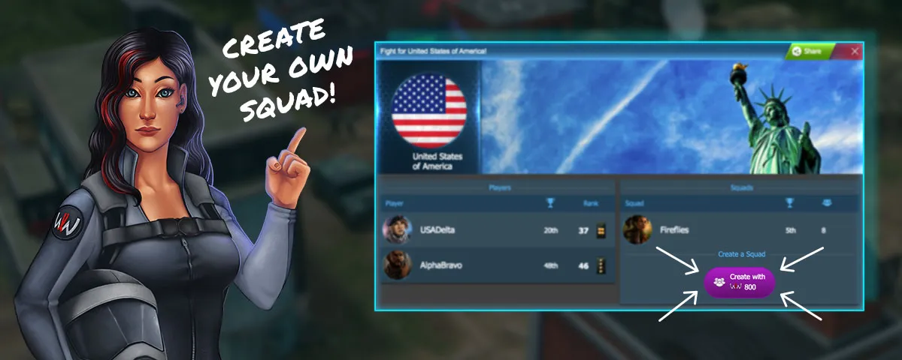
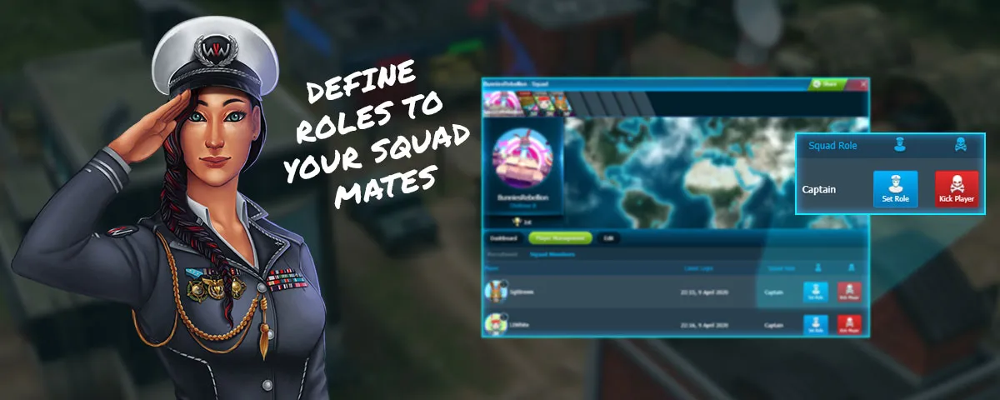
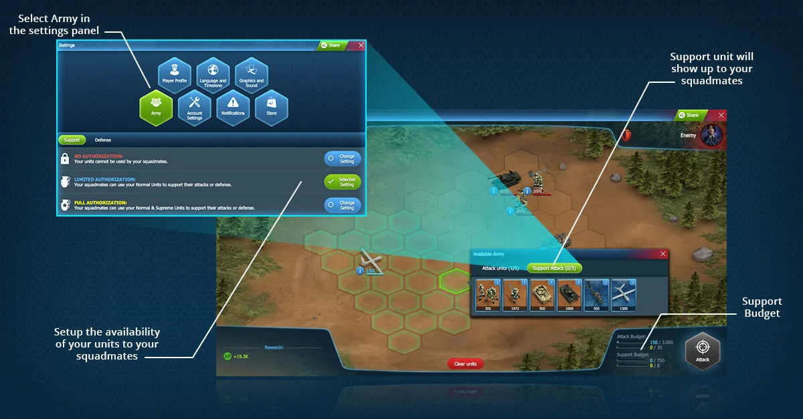

# Squads

Squads are an optional feature in World War Online, but to experience the primary objective of the
game, which is [Capital Warfare](capital-warfare.md), a player must belong to a Squad. It is
strongly recommended that every player join a Squad, as you can unlock many features by being part
of a squad, as collaboration is an important and very helpful aspect of World War Online.

## What is a Squad?

Squads are united groups of players with a collective goal; together they can conquer Capitals,
compete in the [Leaderboard](leaderboard-squad.md) or Support each other in Battles. Each Squad
**may have up to 8 members**, 7 of which may be from a foreign country. Additionally, each Squad has
one Squad Leader and up to three Squad Captains with additional Squad-Related rights.

## Joining a Squad

To become a member of a Squad, there are several methods you can use:

-   You can send a message in the Global Chat saying you are looking for a Squad.
-   Accepting an invitation sent by a Squad Leader/Captain to join their Squad.
-   Clicking on "Join a Squad" under your [Missions](index.md#mission-center) you can see all the
    current available Squads, both from your Country and Worldwide. You can choose one and click in
    the button "Request to Join" so the Leader receives a warning and then accept your request.

## Creating a Squad

You can also create your own Squad, as long as you are [rank 25 or higher](player-rank.md).

**If you fulfill this condition, then you have follow this process:**

-   Click on your Country under your Profile.
-   Click on Create a Squad.
-   Select a Squad Name.
-   Once your squad is created you can edit the settings in your Squad Profile.

## Squad Roles

### Leader

The Squad Leader (generally the player who created the Squad) has access to every tool in the Squad,
including accepting new members, initiating the search for Capital Warfare and choosing Squad
Captains or a new Squad Leader. Squad Leaders can also kick members from the Squad including
Captains.

They also have the ability to create a new Forum post for the Squad where every player that logs
into the game, will automatically view it.

### Captain

The Squad Captains are the seconds-in-command and they have control over the same Squad Features as
the Leader with the exception of selecting new Squad Captains, a new Squad Leader and kicking other
Captains.

### Member

A Member is an ordinary member in the Squad that has no additional rights. This is the rank you
start at when you join a Squad. Members cannot invite or promote players. They can also be kicked
from the Squad by Captains and Leaders.

Rejoining a squad where you were once a captain will not make you a Captain again: you will return
to the rank of Member until you get promoted again.

## Squad Chat

Once you join a Squad, you gain access to its private chat. This [chat](chat.md) shows all recent
messages, including those sent before you joined. This chat serves the purpose of defining your
strategies as a Squad rather than having to send private messages to each squadmate.

## General Squad Features

-   **Change Squad Name**: First name change is free. After this changing the name costs 25
    WWO-Influence
-   **Change Squad Photo**: Here you can Add a Squad Avatar - Where the first change is free, and
    subsequent Avatar changes cost 10 WWO-Influence
-   **Change Squad Background Image**: you can upload an image.
-   **Close Squad**: This will close the squad and kick out all members.
-   **Leave Squad**: You can leave your Squad from here. If you are the last member, it will be the
    same as closing the Squad.

## Sending Support

Players in Squads have the ability to set the Authorization of their Army in Settings, where other
squadmates can use their armies so long as they are located in the same
[District](maps-movement.md).

The advantage of this is that players belonging to a Squad can use **up to 10 Units in Battle**,
whereas those who are not in a squad can only use up to 5. This is one of the major components of
being part of a Squad.

## Changing Squads

You can change Squads at any given time. However, if you do it after the **Capital Warfare
Matchmaking** is done, you won't be able to fight until the next Matchmaking. If this happens and
you have armies in an active capital, we recommend you **move your armies** to another location, as
**the system will prevent you from attacking, but your units can still be killed by other players.**

## Close Squad

Only the Squad Leader can close the squad. This will erase all statistics and kick all members from
the squad. Squads can be closed at any time, except during the final 14 days of each season.

## Squad Alliances

-   Squad Leaders and Captains can invite other Squads for an alliance, accept and deny alliance
    requests, and break current alliances.
-   Squads can have a maximum of 2 allies at each time.
-   Allied Squads won't be matched up against each other at the start of Squad Wars.
-   Allies can help each other during Squad Wars, by attacking armies in Capitals they otherwise
    couldn't. Players can attack the armies of their Ally's enemies on the Capital Bases contested
    by the Ally.

## Related Guides

- [Capital Warfare](capital-warfare.md) - Main squad competition mode
- [Squad Leaderboard](leaderboard-squad.md) - Rankings, leagues, and rewards
- [Battle Rules](battle-rules.md#capital-specific-rules) - Rules for attacking capitals
- [Tactical Units](units-tactic.md) - Using Generals to conquer bases
- [Chat](chat.md) - Communicate with squad members
