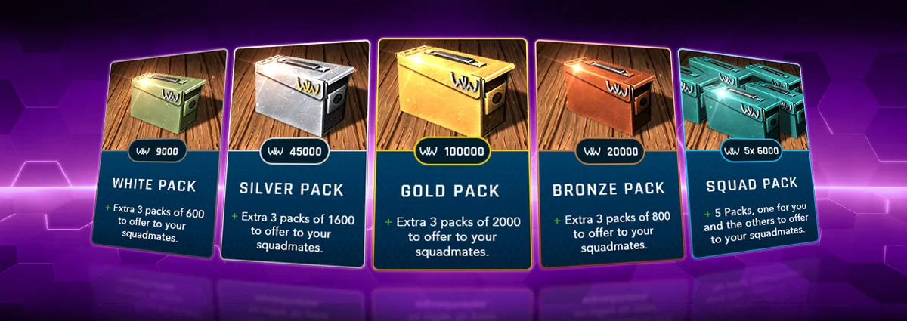

# Store Packs

The Store offers various WWO-Influence packs for purchase, each providing premium currency and bonus packs to share with Battalion members.

## Available Packs

| Pack | WWO-Influence | Bonus Packs | Bonus Amount |
|:-----|:-------------:|:-----------:|:------------:|
| **Gold Pack** | 10,000 WWO | 3 packs | 200 WWO each |
| **Silver Pack** | 4,500 WWO | 3 packs | 160 WWO each |
| **Bronze Pack** | 2,000 WWO | 3 packs | 80 WWO each |
| **White Pack** | 900 WWO | 3 packs | 60 WWO each |
| **Battalion Pack** | 600 WWO | 4 packs | 600 WWO each |

## Pack Details

### Gold Pack

The premium option for serious players:

- **10,000 WWO-Influence** for yourself
- **3 bonus packs** of 200 WWO each to gift to Battalion members
- Best value per WWO for large purchases

### Silver Pack

A solid mid-tier choice:

- **4,500 WWO-Influence** for yourself
- **3 bonus packs** of 160 WWO each for Battalion members
- Good balance of personal and team benefits

### Bronze Pack

Entry-level premium purchase:

- **2,000 WWO-Influence** for yourself
- **3 bonus packs** of 80 WWO each for Battalion members
- Affordable way to support your battalion

### White Pack

Smallest individual pack:

- **900 WWO-Influence** for yourself
- **3 bonus packs** of 60 WWO each for Battalion members
- Low-commitment option

### Battalion Pack

Designed for team support:

- **600 WWO for yourself**
- **4 packs of 600 WWO** to gift to Battalion members
- Maximizes battalion benefit over personal gain

## Weekly Purchase Limits

The Store enforces fair competition through purchase limits:

| Limit | Details |
|:------|:--------|
| **Maximum** | 10,000 WWO worth of items |
| **Reset Period** | Every 6 days |
| **Countdown** | Shows when you can purchase again |

Plan your purchases strategically within this allowance.

## First Purchase Bonus

Your **first purchase each season** includes a special bonus:

- Receive **half the pack value in Supreme Units**
- Supreme Units appear as collectible packs in the Store section
- Only applies to Gold, Silver, Bronze, White, or Battalion packs

## Gifting Bonus Packs

Bonus packs from your purchases can be gifted to Battalion members:

1. Purchase any pack with bonus packs
2. Navigate to your Store inventory
3. Select bonus packs to gift
4. Choose Battalion members to receive them

This system encourages battalion cooperation and rewards active purchasing.

## Related Guides

- [Store Overview](store.md) - Complete store guide
- [Store Sections](store-sections.md) - Supply crates and collectibles
- [Payment Methods](store-payments.md) - How to purchase
- [Resources](resources.md) - Using WWO-Influence
