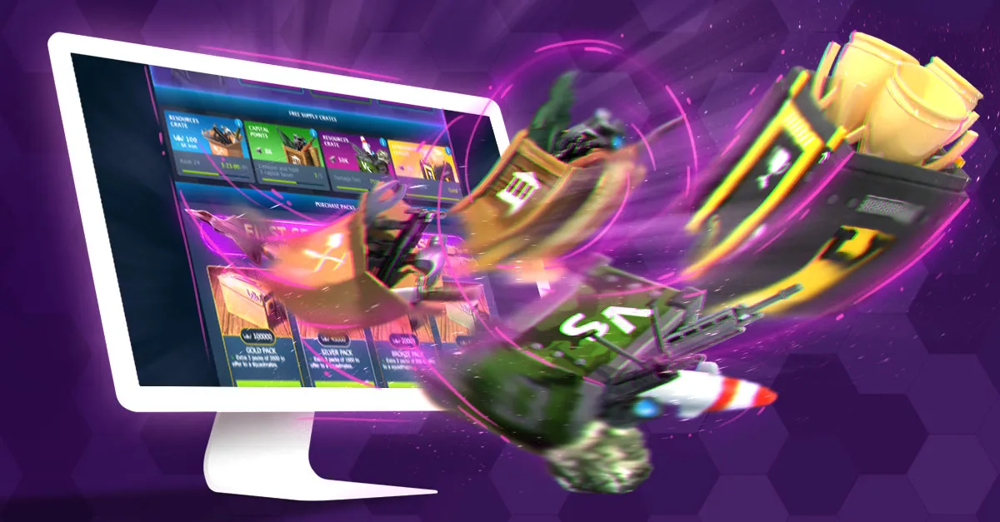

# Store

The [Store](https://www.worldwaronline.com/store) is the location in World War Online where you
collect your Daily WWO-Influence (up to a maximum of 2.000 free WWO). It is also used to purchase
and spend WWO-Influence, or redeem coupon codes offered by the game. You can learn more about how
World War Online Store works, in our [Store Rules](../legal/store-rules.md). In Store Section you
can also collect your Supply Crates and Unit Packs.

## In-Game Purchases

Through the main page of the Store, players can purchase the Premium In-Game Currency for World War
Online (For more information check WWO-Influence).

### Weekly Purchase Limits

The Store provides a strategic purchasing system that ensures fair competition:

-   **Purchase Limit**: You can purchase up to **10,000 WWO** worth of items every **6 days**
-   **Fair Progression**: This system helps ensure all players have a balanced experience
-   **Clear Interface**: The Store interface shows exactly when you can purchase again
-   **Reset Timer**: A countdown displays when your purchase window will refresh

Plan your Store purchases strategically to make the most of your weekly allowance.

## WWO Packs

-   **Gold Pack:** Contains 10.000 WWO and 3 extra packs of 200 WWO to offer to Battalion members.
-   **Silver Pack:** Contains 4.500 WWO and 3 extra packs of 160 WWO to offer to Battalion members.
-   **Bronze Pack:** Contains 2.000 WWO and 3 extra packs of 80 WWO to offer to Battalion members.
-   **White Pack:** Contains 900 WWO and 3 extra packs of 60 WWO to offer to Battalion members.
-   **Battalion Pack:** Contains 5 packs of 600 WWO - 1 for you and 4 that can be offered to Battalion members.

## Supply Crates

-   **Experience Crate:** based on experience earned, collectible every 8 hours.
-   **Damage Crate:** based on Damage Dealt in Attacks sent to other players, collectible every 12
    hours.
-   **Supreme Crate:** based on supreme units killed in battles, collectible every 24 hours.
-   **Capital Crate:** Capital points earned for Battalion, collectible every 24 hours.

## First Purchase Season Pack

First Purchase Season Pack relates to the **first purchase** a player does on a Season. By
purchasing one of the available Packs (Gold, Silver, Bronze, White or Battalion), a player will receive
**half of its value in Supreme Units**. These Supreme Units will appear as packs in the Store
section.

## Special Deals

Special deals are packs of units and XP that can be acquired with special discounts. These are
bought with WWO-Influence.
