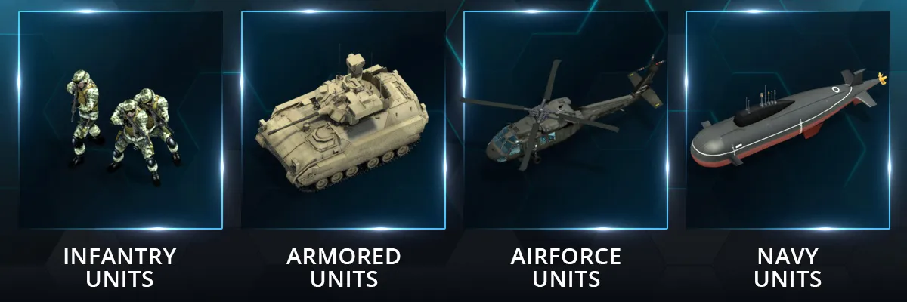

# Introduction to Units

Units are used to fight in World War Online.

There are 4 different types of Units within World War Online:

-   Infantry Units;
-   Armored Units;
-   Airforce Units;
-   Navy Units.

Commanders unlock Units as their [Military Rank](player-rank.md) increases. There are also three
different classes of Units:

-   [Normal Units](units-normal.md), which only cost Iron. They'll constitute the bulk of your Army;
-   [Supreme Units](units-supreme.md), which cost WWO-Influence or Money. They're much stronger than
    Normal Units but they fight in lower numbers;
-   [Tactical Units](units-tactic.md), which have the special role of Conquering Bases.
